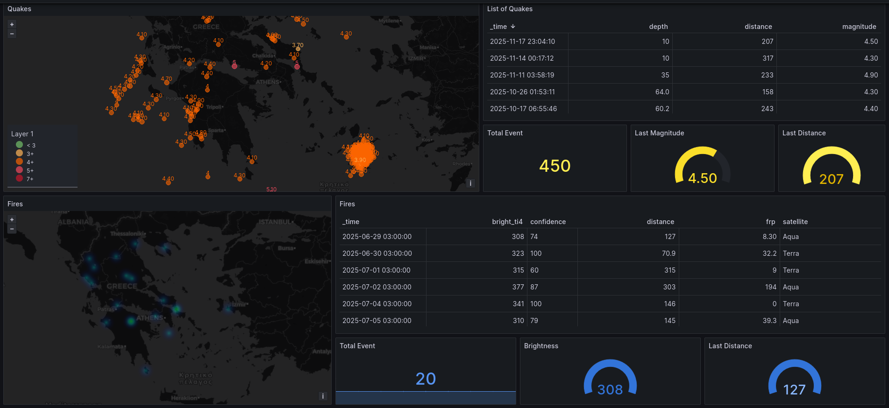
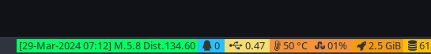

# Wobble Alert

## Description

The application will query via API calls all recent earthquakes and fire within a specific radius from the defined location set in the properties.

> still learning Rust... (⌒‿⌒)/

## Built with & Requirements

* Rust
* InfluxDB
* Grafana

## Getting started

### Install Rust & Cargo
Install Rust on your local machine| to do so please follow the official documentation

[Rust get started](https://www.rust-lang.org/learn/get-started)

### Get a local copy using git
```bash
git clone git@github.com:lunarust/wobblealert.git
```

### Properties
Copy the file Development.toml to Default.toml and replace the values between angle brackets.

### Start the application:

```bash
cd src
cargo run
```

## Data Collected

### Earthquakes

- Source:
  - [USGS](https://www.usgs.gov/programs/earthquake-hazards)
  - [Api DOC](https://earthquake.usgs.gov/fdsnws/event/1/)

- Data format:

API receives JSON.

Quake:
|  Column |  Type  |  Origin  |  Description   |
|---------|--------|----------|----------------|
|url|String|API|Link to the event|
|alert|String|Mapped| |
|code|String|API|Identifier|
|magnitude|f64|API|Event magnitude|
|distance|f64|Calculated|Distance in km|
|longitude|f64|API| |
|latitude|f64|API| |
|depth|f64|API| |
|time|i64|API| |

<details>
<summary>JSON Data Sample:</summary>

```json
{
    "type": "FeatureCollection"|
    "metadata": {
        "generated": 1763544246000|
        "url": "https://earthquake.usgs.gov/fdsnws/event/1/query?format=geojson&starttime=2025-11-15&endtime=2025-11-19"|
        "title": "USGS Earthquakes"|
        "status": 200|
        "api": "1.14.1"|
        "count": 1056
    }|
    "features": [
        {
            "type": "Feature"|
            "properties": {
                "mag": 1.503948263416901|
                "place": "25 km W of Anderson| Alaska"|
                "time": 1763509609922|
                "updated": 1763509669273|
                "tz": null|
                "url": "https://earthquake.usgs.gov/earthquakes/eventpage/ak2025wtbkbf"|
                "detail": "https://earthquake.usgs.gov/fdsnws/event/1/query?eventid=ak2025wtbkbf&format=geojson"|
                "felt": null|
                "cdi": null|
                "mmi": null|
                "alert": null|
                "status": "automatic"|
                "tsunami": 0|
                "sig": 35|
                "net": "ak"|
                "code": "2025wtbkbf"|
                "ids": "|ak2025wtbkbf|"|
                "sources": "|ak|"|
                "types": "|origin|phase-data|"|
                "nst": 8|
                "dmin": 0.36242613196372986|
                "rms": 0.34305361119462996|
                "gap": 161.23315811157227|
                "magType": "ml"|
                "type": "earthquake"|
                "title": "M 1.5 - 25 km W of Anderson| Alaska"
            }|
            "geometry": {
                "type": "Point"|
                "coordinates": [
                    -149.71719360351562|
                    64.36441040039062|
                    18.873268127441406
                ]
            }|
            "id": "ak2025wtbkbf"
        }  
      ]|
    "bbox": [
        -179.6169|
        -61.1895|
        -2.95|
        179.1443|
        68.66081237793|
        577.565
    ]
}
```
</details>

### Fire

- Source:
  - [FIRMS](https://firms.modaps.eosdis.nasa.gov/)
  - [Api DOC](https://firms.modaps.eosdis.nasa.gov/api/)
  - [Fire footprint area formula](https://firms.modaps.eosdis.nasa.gov/tutorials/fire-footprint/)
  - [satellite Availability](https://firms.modaps.eosdis.nasa.gov/api/data_availability/csv/322e359dab64a838314a1e1bed6a5f5e/all)
  - [Box check](https://firms.modaps.eosdis.nasa.gov/api/area/csv/322e359dab64a838314a1e1bed6a5f5e/VIIRS_SNPP_NRT/85|15|120|60/1/2025-11-18)


- Data format:

TEXT / CSV

| # |  Column |  Non-Null Count | Dtype |  
|---|---------|-----------------|-------|
| 0 |  latitude |   74605 non-null | float64 |
| 1 |  longitude |  74605 non-null | float64 |
| 2 |  bright_ti4 | 74605 non-null | float64 |
| 3 |  scan |       74605 non-null | float64 |
| 4 |  track |      74605 non-null | float64 |
| 5 |  acq_date |   74605 non-null | string |
| 6 |  acq_time |   74605 non-null | int64  |
| 7 |  satellite |  74605 non-null | string |
| 8 |  instrument | 74605 non-null | string |
| 9 |  confidence | 74605 non-null | string |
| 10 | version    | 74605 non-null | string |
| 11 | bright_ti5 | 74605 non-null | float64 |
| 12 | frp        | 74605 non-null | float64 |
| 13 | daynight   | 74605 non-null | string |

<details>
<summary>CSV Data Sample:</summary>

|latitude|longitude|bright_ti4|scan|track|acq_date|acq_time|satellite|instrument|confidence|version|bright_ti5|frp|daynight|
|--------|---------|----------|----|-----|--------|--------|---------|----------|----------|-------|----------|---|--------|
|38.73814|26.95066|296|0.58|0.7|2025-11-18|111|N|VIIRS|n|2.0NRT|283.96|1.07|N|
|38.73964|26.95093|298.8|0.58|0.69|2025-11-18|111|N|VIIRS|n|2.0NRT|283.87|1.19|N|
|38.74016|26.9441|295.18|0.58|0.69|2025-11-18|111|N|VIIRS|n|2.0NRT|284.05|1.07|N|

</details>


## Flood

On hold,

Open meteo doesn't allow coordbox, a single coordinates looks messy
Copernicus seems to be working on a newer version, public dataset are flagged as offline

https://eonet.gsfc.nasa.gov/docs/v2.1
https://api.nasa.gov/


https://eonet.gsfc.nasa.gov/api/v2.1/events?status=open&limit=5

https://confluence.ecmwf.int/plugins/viewsource/viewpagesrc.action?pageId=43523060
https://cds.climate.copernicus.eu/api/profiles/v1/docs#/default/handle_metrics_metrics_get
https://cds.climate.copernicus.eu/how-to-api#advanced-users-section
https://ewds.climate.copernicus.eu/api/catalogue/v1/docs#/default/Get_Collections_collections_get

Request URL
https://ewds.climate.copernicus.eu/api


[Open meteo Flood API Call](https://open-meteo.com/en/docs/flood-api?location_mode=bounding_box&bounding_box=-90,-180,90,180)

Endpoint: "https://flood-api.open-meteo.com/v1/flood"

Params:
&bounding_box=30,-20,60,40
start_date
end_date
timeformat=unixtime
ensemble=True

test:
https://flood-api.open-meteo.com/v1/flood?bounding_box=30,-20,60,40&start_date=2025-11-12&end_date=2025-11-15&timeformat=unixtime&ensemble=True


## Database:
### InfluxDB

[Influx API Doc](https://docs.influxdata.com/influxdb/v2/api/#operation/PostQuery)

```bash
curl --request POST 'http://192.168.1.1:8086/api/v2/query?org=org.local' \
--header 'Content-Type: application/vnd.flux' \
--header 'Accept: application/json' \
--header "Authorization: Token APITOKEN" \
--data 'from(bucket: "wobbly") |> range(start: 0) |> filter(fn: (r) => r._measurement == "quake")'

```

|  _time  |  _value  |  _field  |  _measurement  |  alert  | code  |  url  |
|---------|----------|----------|----------------|---------|-------|-------|
|2023-10-13T03:33:14.082Z|10|depth|quake|green|6000lf9u||
|2023-10-13T03:33:14.082Z|122.415017|distance|quake|green|6000lf9u||
|2023-10-13T03:33:14.082Z|37.851|latitude|quake|green|6000lf9u||


```sql
from(bucket: "wobbly")
|>  range(start: 0| stop: now())  
|> filter(fn: (r) => r["_measurement"] == "ready")
|> filter(fn: (r) => r["_field"] == "result")
|> sort(columns: ["_time"]| desc: false)
|> last()
```

### Grafana




[json Dashboard file](./doc/Dashboard_final.json)


### Others

<details>
<summary>I3Status</summary>



Configuration file:
```yaml
order += "read_file wobblealert"

read_file wobblealert {
        path = "~/.config/i3/alerti3"
        format = "%content"
        separator_block_width = 0
}
```

</details>

--

<details>

<summary>Zabbix & Telegram</summary>
/var/log/scripts/wobblealert

Create a Bot
https://core.telegram.org/bots/tutorial
BotFather will give you the ID upon creation.

Add your bot to a channel or group| your bot must have admin access.

Get your group id:
https://api.telegram.org/bot<TOKEN>/getUpdates


In Zabbix
> Data Collection > Templates
Create a new Template and Template group to easily identify your custom rules
Create an application and a trigger (with older version you need to create a graph as well)
Assign the template to your host.

> alert > media Type:
Enable Telegram
Edit the entry and add your bot token

> Users > Users:
Create or edit an existing User| create an entry in tab Media for Telegram| with the ID of your channel.

> Alerts > Actions > Trigger action:
Create an action for your Telegram alert with all the required filter.


A default alert looks as follow:
```text
Problem: Wobble
Problem started at 11:54:26 on 2024.04.02
Problem name: Wobble
Host: Gumbys
Severity: Disaster
Operational data: 2024-04-02 10:27:01 [ALERT] M.7 D.156
Original problem ID: 72518
```
still working on alerts / these are triggered but dont resolves themselves... yet
But you can configure the format of an alert either in alert > Media.

</details>

## Acknowledgments
